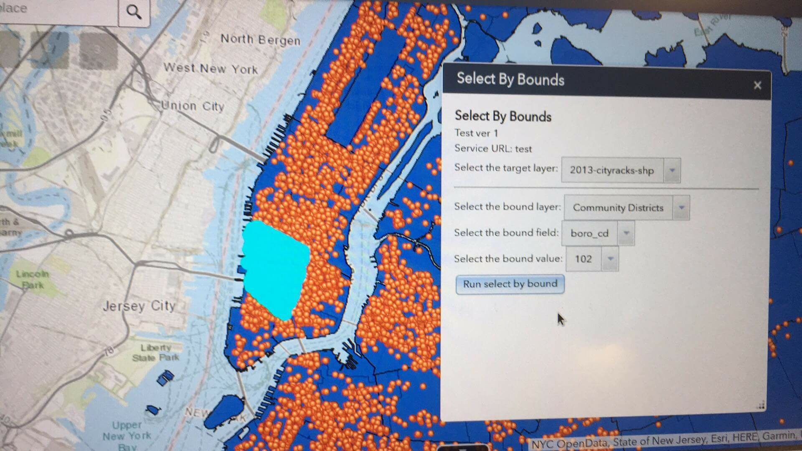

## Select By Bounds
A simple ArcGIS Web AppBuilder custom widget that will select by location on the target layer based on a select by attribute of the (source) bound layer.

Doesn't use any credits.

Built using [generator-esri-appbuilder-js](https://github.com/Esri/generator-esri-appbuilder-js) with [this as an example](https://developers.arcgis.com/web-appbuilder/sample-code/create-a-listview-widget.htm)